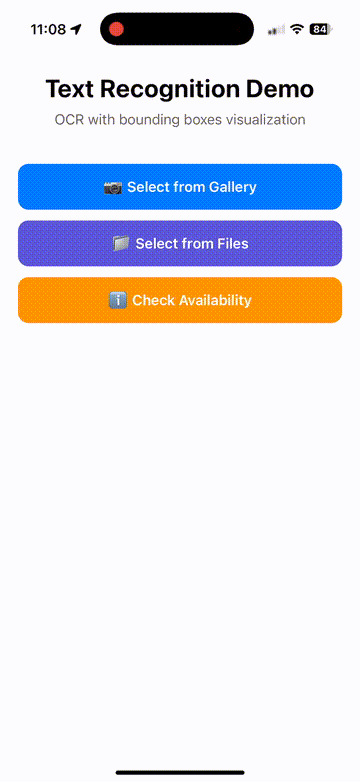

# react-native-text-recognition

Advanced OCR text recognition for React Native with Vision API (iOS) and ML Kit (Android). Supports multi-language recognition, PDF files, and both old and new React Native architectures.

[](https://badge.fury.io/js/@dariyd%2Freact-native-text-recognition)
[](https://opensource.org/licenses/MIT)

## Features

- 🎯 **Smart Defaults**: Automatically detects file types (PDF/image) and applies optimal settings - no configuration needed!
- 📱 **Cross-platform**: iOS 13+ and Android 21+
- 🚀 **New Architecture Ready**: Full TurboModule support on iOS, Bridge compatibility on Android (works with both old and new arch)
- 🔤 **Multi-language Support**: Recognizes text in 100+ languages with automatic detection
- 📄 **PDF Support**: High-quality PDF text extraction (400 DPI by default) on both platforms
- 🎯 **Flexible Results**: Get text with bounding boxes, confidence scores, and coordinates
- 🔍 **Recognition Levels**: Automatic smart defaults, or choose between word, line, or block level
- ⚡ **Modern APIs**: 
  - iOS: Uses VNRecognizeTextRequestRevision3 (iOS 16+) with automatic fallback
  - Android: Uses Google ML Kit Text Recognition v2
- 📊 **Rich Metadata**: Get page numbers, dimensions, and hierarchical text structure

## Demo

See the library in action:

| iOS Demo | Android Demo |
|----------|--------------|
|  |  |

The demo shows:
- 📷 Selecting images from gallery and files
- 📄 Processing PDF documents
- 🔍 Real-time OCR with bounding boxes
- 📊 Displaying recognized text with confidence scores
- 🌐 Multi-language support (English, Italian, Ukrainian, etc.)

## Installation

```bash
npm install @dariyd/react-native-text-recognition
```

or with yarn:

```bash
yarn add @dariyd/react-native-text-recognition
```

### iOS Setup

Install pods:

```bash
cd ios && pod install && cd ..
```

**Important for iOS:** The library requires iOS 13.0 or higher. If you encounter build errors, ensure your `ios/Podfile` has:

```ruby
platform :ios, '13.0'
```

**Optional:** Add camera permission to your `Info.plist` (only if scanning from camera):

```xml
<key>NSCameraUsageDescription</key>
<string>We need access to your camera to scan documents</string>
<key>NSPhotoLibraryUsageDescription</key>
<string>We need access to your photo library to select images</string>
```

### Android Setup

The module automatically includes ML Kit dependencies. No additional setup required.

**Important for Android:** Ensure your `android/build.gradle` has:

```gradle
buildscript {
    ext {
        minSdkVersion = 21
        compileSdkVersion = 35
        targetSdkVersion = 35
    }
}
```

**Optional:** Add permissions to your `AndroidManifest.xml` (only if scanning from camera or accessing storage):

```xml
<uses-permission android:name="android.permission.CAMERA" />
<uses-permission android:name="android.permission.READ_EXTERNAL_STORAGE" />
```

### New Architecture Support

**iOS:** ✅ **Full TurboModule support** (automatically detected)
**Android:** ✅ **Bridge mode with full compatibility** (works with `newArchEnabled=true`)

The library works seamlessly with React Native's new architecture:
- iOS uses native TurboModules implementation
- Android uses the stable Bridge API (fully compatible with new architecture apps)

No special configuration needed - just install and use! 🎉

## Requirements

- **React Native**: 0.77.3 or higher
- **React**: 18.2.0 or higher
- **iOS**: 
  - Minimum: iOS 13.0
  - Recommended: iOS 16.0+ (for VNRecognizeTextRequestRevision3 - best accuracy)
  - Note: Automatically uses best available API for each iOS version
- **Android**: 
  - Min SDK: API 21 (Android 5.0)
  - Target SDK: API 35 (Android 15)
  - Compile SDK: API 35

## Usage

### Basic Usage - Just Works! 🎯

The library automatically detects file types and applies optimal settings:

```javascript
import { recognizeText } from '@dariyd/react-native-text-recognition';

// Works for both images and PDFs with smart defaults
const result = await recognizeText('file:///path/to/image.jpg');
const pdfResult = await recognizeText('file:///path/to/document.pdf');

console.log(result.fullText); // All recognized text
console.log(result.pages); // Detailed page-by-page results
```

**Smart defaults behind the scenes:**
- 📄 **PDFs**: 400 DPI + line recognition + auto language
- 🖼️ **Images**: Word recognition + auto language

### With Options

```javascript
// Auto-detect languages (iOS 16+ recommended)
const result = await recognizeText('file:///path/to/image.jpg', {
  languages: [], // Empty array = auto-detect on iOS 16+
  recognitionLevel: 'word',
});

// PDFs are automatically optimized (400 DPI + line recognition)
const result = await recognizeText('file:///path/to/document.pdf');
// That's it! Or customize if needed:
const customResult = await recognizeText('file:///path/to/document.pdf', {
  languages: ['en', 'es'],  // Language hints (optional, auto-detects by default)
  maxPages: 10,             // Limit number of pages
  pdfDpi: 600,              // Higher quality (optional, 400 is default)
});

// Access detailed results
result.pages.forEach((page) => {
  console.log(`Page ${page.pageNumber}:`);
  page.elements.forEach((element) => {
    console.log(`  Text: ${element.text}`);
    console.log(`  Confidence: ${element.confidence}`);
    console.log(`  BoundingBox:`, element.boundingBox);
  });
});
```

### Legacy API (Backward Compatible)

```javascript
import { detectText } from '@dariyd/react-native-text-recognition';

// Old API still works
const result = await detectText('file:///path/to/image.jpg');
console.log(result.detectedWords);
```

### Check Availability

```javascript
import { isAvailable, getSupportedLanguages } from '@dariyd/react-native-text-recognition';

const available = await isAvailable();
console.log('Text recognition available:', available);

const languages = await getSupportedLanguages();
console.log('Supported languages:', languages);
```

## PDF Recognition - Smart Defaults

**The library automatically detects PDFs and applies optimized settings!** No configuration needed.

### Automatic PDF Optimization:
- ✅ **400 DPI rendering** (high quality)
- ✅ **Line-level recognition** (better for PDFs than word-level)
- ✅ **Auto language detection** (iOS 16+)

```javascript
// PDFs are automatically optimized - just call recognizeText!
const result = await recognizeText(pdfUri);
// Behind the scenes: 400 DPI + line recognition + auto language
```

### How It Works:

The library detects the file extension and automatically applies the best settings:

| File Type | Recognition Level | DPI | Notes |
|-----------|------------------|-----|-------|
| **PDF** | `line` (auto) | 400 | Optimized for documents |
| **Image** (jpg, png) | `word` (auto) | N/A | Optimized for photos |

**You can still override any setting:**

```javascript
const result = await recognizeText(pdfUri, {
  recognitionLevel: 'word',  // Override to word-level
  pdfDpi: 600,              // Override to higher DPI
  languages: ['en', 'it'],  // Override auto-detect
});
```

### Advanced: Need Even Higher Quality?

For PDFs with very small text, you can increase the DPI:

```javascript
const result = await recognizeText(pdfUri, {
  pdfDpi: 600,  // Even higher quality (slower)
  languages: [],
});
```

**DPI Guidelines:**
- **400 DPI**: High quality for most documents ✅ **(default)**
- **600+ DPI**: Very small text or maximum quality (slower)

### Troubleshooting: Scanned PDFs

### 1. **Enable Preprocessing for Scanned PDFs**

If your PDF is a scanned image (not digital text), enable preprocessing:

```javascript
const result = await recognizeText(scannedPdfUri, {
  pdfDpi: 400,
  preprocessImages: true,  // Grayscale + contrast boost
  recognitionLevel: 'line', // Better for scanned documents
});
```

**⚠️ Warning**: Don't use `preprocessImages: true` for clean digital PDFs - it will REDUCE accuracy!

### 2. **Adjust Recognition Level**

- `'word'` (default): Best for most documents
- `'line'`: Better for scanned PDFs or low-quality images
- `'block'`: Faster but less detailed

### 3. **Complete Example for Scanned PDFs**

```javascript
// Scanned/Low-quality PDF
const result = await recognizeText(scannedPdfUri, {
  languages: ['en', 'it'], // Language hints help
  pdfDpi: 500,             // Even higher for scans (optional)
  recognitionLevel: 'line', // Better for scans
  preprocessImages: true,   // Enable for scanned PDFs
});
```

**Note:** Most digital PDFs work perfectly at the default 400 DPI without any configuration!

### Common Issues:

| Problem | Solution |
|---------|----------|
| Text is jumbled/wrong | Try `pdfDpi: 600` or `recognitionLevel: 'line'` |
| Missing text | Enable `preprocessImages: true` for scanned PDFs |
| Scanned PDF not working | Set `preprocessImages: true` and `recognitionLevel: 'line'` |
| Slow processing | Default is optimized; reduce to `pdfDpi: 300` if needed |

## API Reference

### `recognizeText(fileUrl, options?, callback?)`

Main method to recognize text from images or PDFs.

**Parameters:**
- `fileUrl` (string): Local file URL (file://, content://, or http(s)://)
- `options` (object, optional): Recognition options
  - `languages` (string[]): Language hints (e.g., ['en', 'es'])
  - `recognitionLevel` ('word' | 'line' | 'block'): Level of text segmentation
  - `useFastRecognition` (boolean): Use fast mode (lower accuracy, faster)
  - `maxPages` (number): For PDFs, maximum pages to process
  - `pdfDpi` (number): For PDFs, DPI for rendering (default: 300)
- `callback` (function, optional): Callback for compatibility

**Returns:** `Promise<TextRecognitionResult>`

### Result Structure

```typescript
interface TextRecognitionResult {
  success: boolean;
  error?: boolean;
  errorMessage?: string;
  pages?: RecognizedPage[];
  totalPages?: number;
  fullText?: string;
}

interface RecognizedPage {
  pageNumber: number;
  dimensions: {
    width: number;
    height: number;
  };
  elements: RecognizedTextElement[];
  fullText: string;
}

interface RecognizedTextElement {
  text: string;
  confidence: number; // 0-1
  level: 'word' | 'line' | 'block';
  boundingBox: {
    x: number; // Normalized 0-1
    y: number; // Normalized 0-1
    width: number; // Normalized 0-1
    height: number; // Normalized 0-1
    absoluteBox?: {
      x: number; // Pixels
      y: number; // Pixels
      width: number; // Pixels
      height: number; // Pixels
    };
  };
  language?: string;
}
```

### Other Methods

- `detectText(imageUrl, callback?)`: Legacy method for backward compatibility
- `isAvailable()`: Check if text recognition is available
- `getSupportedLanguages()`: Get list of supported language codes

## Automatic Language Detection

The SDK supports automatic language detection - **you don't need to specify languages**:

### iOS 16+
✅ **Fully automatic** - Detects and recognizes 100+ languages automatically
- Set `languages: []` or omit the option entirely
- Automatically detects: Latin, CJK (Chinese/Japanese/Korean), Arabic, Hebrew, Cyrillic, Indic scripts, and more
- Perfect for mixed-language documents
- Uses `automaticallyDetectsLanguage` with `VNRecognizeTextRequestRevision3`

```javascript
// Will auto-detect English, Chinese, Arabic, etc.
const result = await recognizeText(imageUri, {
  languages: [], // Auto-detect
});
```

### iOS 13-15
⚠️ **Limited auto-detection** - Works best with common scripts
- Defaults to English + common European languages
- May need language hints for non-Latin scripts

### Android
⚠️ **Script-based** - Better with language hints
- Defaults to Latin script recognizer
- For Chinese/Japanese/Korean/Devanagari: provide language hints

### When to Specify Languages?

**Specify languages for:**
- ✅ Better accuracy when you know the language(s)
- ✅ Faster processing (skips detection)
- ✅ Non-Latin scripts on older iOS or Android

**Use auto-detection for:**
- ✅ Unknown language documents
- ✅ Mixed-language content
- ✅ iOS 16+ with maximum flexibility

```javascript
// Known languages = better accuracy
const result = await recognizeText(imageUri, {
  languages: ['it', 'en'], // Italian + English
});

// Unknown languages = auto-detect
const result = await recognizeText(imageUri, {
  languages: [], // Let SDK detect
});
```

## Supported Languages

### iOS (Vision API)

**iOS 16+ (VNRecognizeTextRequestRevision3)** - 100+ languages including:
- Latin scripts: English, Spanish, French, German, Italian, Portuguese, Dutch, Swedish, etc.
- Chinese (Simplified & Traditional)
- Japanese
- Korean
- Arabic
- Hebrew
- Thai
- Vietnamese
- Russian, Ukrainian
- Hindi, Bengali
- And 90+ more languages

**iOS 13-15 (Automatic fallback)** - 20+ languages including:
- English, French, Italian, German, Spanish, Portuguese
- Chinese (Simplified & Traditional)
- Japanese, Korean
- Russian
- Limited coverage compared to iOS 16+

**Note:** The library automatically uses the best available API for your iOS version.

### Android (ML Kit)
- Latin script (English, Spanish, French, German, Italian, Portuguese, etc.)
- Chinese (Simplified & Traditional)
- Japanese
- Korean
- Devanagari (Hindi, Sanskrit, Marathi, Nepali)
- Arabic
- Thai
- Vietnamese

## Platform Differences

While both platforms provide similar functionality, there are some differences:

### iOS
- Uses native Vision framework
- VNRecognizeTextRequestRevision3 on iOS 16+ for best results
- Automatic fallback to earlier revisions on older iOS versions
- Native PDF support via PDFKit
- Provides confidence scores for recognized text

### Android
- Uses Google ML Kit Text Recognition
- Multiple specialized recognizers for different scripts
- PDF rendering via PDF Box Android
- Confidence scores not available (returns 1.0)
- Requires Google Play Services

## React Native New Architecture

This module requires **React Native 0.77.3 or higher** and is **fully compatible** with the new architecture.

### iOS
✅ **Native TurboModule implementation**
- Automatically detected when `RCT_NEW_ARCH_ENABLED=1`
- Seamless fallback to Bridge mode on old architecture
- Uses VNRecognizeTextRequestRevision3 on iOS 16+ for best accuracy
- Automatically falls back to earlier revisions on iOS 13-15

### Android
✅ **Bridge mode with full compatibility**
- Uses stable Bridge API (ReactPackage)
- Works seamlessly with `newArchEnabled=true` (new arch apps)
- Works with `newArchEnabled=false` (old arch apps)
- Full backward compatibility with React Native's interop layer

**Why Bridge mode on Android?**
React Native 0.60+ provides excellent interoperability between Bridge and TurboModule APIs. Bridge modules work perfectly in new architecture apps without any issues or performance penalties for this use case.

## Examples

### Recognize Text from Image

```javascript
import { recognizeText } from '@dariyd/react-native-text-recognition';

const recognizeImage = async (imagePath) => {
  try {
    const result = await recognizeText(imagePath, {
      languages: ['en'],
      recognitionLevel: 'word',
    });

    if (result.success) {
      console.log('Full text:', result.fullText);
      
      // Get all words with their positions
      result.pages[0].elements.forEach((word) => {
        console.log(`"${word.text}" at position:`, word.boundingBox);
      });
    }
  } catch (error) {
    console.error('Recognition failed:', error);
  }
};
```

### Extract Text from PDF

```javascript
import { recognizeText } from '@dariyd/react-native-text-recognition';

const extractPdfText = async (pdfPath) => {
  try {
    const result = await recognizeText(pdfPath, {
      languages: ['en', 'es'],
      recognitionLevel: 'line',
      maxPages: 5, // Process first 5 pages
      pdfDpi: 200, // Lower DPI for faster processing
    });

    if (result.success) {
      console.log(`Processed ${result.pages.length} of ${result.totalPages} pages`);
      
      result.pages.forEach((page) => {
        console.log(`\nPage ${page.pageNumber + 1}:`);
        console.log(page.fullText);
      });
    }
  } catch (error) {
    console.error('PDF processing failed:', error);
  }
};
```

### Multi-language Recognition

```javascript
const result = await recognizeText('file:///path/to/multilingual.jpg', {
  languages: ['en', 'zh', 'ja', 'ko'], // English, Chinese, Japanese, Korean
  recognitionLevel: 'block',
});
```

## Troubleshooting

### iOS Issues

**"VNRecognizeTextRequest failed"**
- Ensure the image file exists and is readable
- Check that the URL scheme is correct (file://)
- Verify iOS version is 13.0 or higher

**PDF recognition not working**
- PDF support requires iOS 11.0+
- Ensure the PDF is not encrypted or password-protected

### Android Issues

**"ML Kit not available"**
- Ensure Google Play Services is installed
- Check minimum SDK version is 21+
- Verify internet connection for first-time model download

**Out of memory with PDFs**
- Reduce `pdfDpi` option (try 150-200 instead of 300)
- Process fewer pages using `maxPages` option
- Process pages one at a time in a loop

## Performance Tips

1. **Choose appropriate DPI**: For PDFs, 300 DPI provides excellent quality but is slower. Use 150-200 for faster processing.
2. **Limit pages**: Use `maxPages` option when you don't need the entire PDF.
3. **Use fast recognition**: Set `useFastRecognition: true` for real-time scenarios (iOS only).
4. **Recognition level**: 'block' is fastest, 'word' provides most detail.
5. **Language hints**: Providing specific languages improves accuracy and speed.

## Comparison with Other Solutions

| Feature | This Library | react-native-mlkit | react-native-text-detector |
|---------|-------------|-------------------|---------------------------|
| iOS Support | ✅ Vision API | ❌ | ✅ |
| Android Support | ✅ ML Kit v2 | ✅ ML Kit | ✅ |
| PDF Support | ✅ | ❌ | ❌ |
| Multi-language | ✅ 100+ | ✅ | ⚠️ Limited |
| Bounding Boxes | ✅ | ✅ | ✅ |
| New Architecture | ✅ iOS | ❌ | ❌ |
| TypeScript | ✅ | ⚠️ Partial | ❌ |
| Active Maintenance | ✅ | ⚠️ | ❌ |

## Contributing

Contributions are welcome! Please feel free to submit a Pull Request.

## License

MIT © [dariyd](https://github.com/dariyd)

## Acknowledgments

- iOS implementation inspired by [react-native-image-picker](https://github.com/react-native-image-picker/react-native-image-picker)
- Android implementation uses [Google ML Kit](https://developers.google.com/ml-kit)
- Reference architecture from [react-native-document-scanner](https://github.com/dariyd/react-native-document-scanner)

## Related Projects

- [react-native-document-scanner](https://github.com/dariyd/react-native-document-scanner) - Document scanning with VisionKit and ML Kit
- [react-native-vision-camera](https://github.com/mrousavy/react-native-vision-camera) - Camera library for React Native
